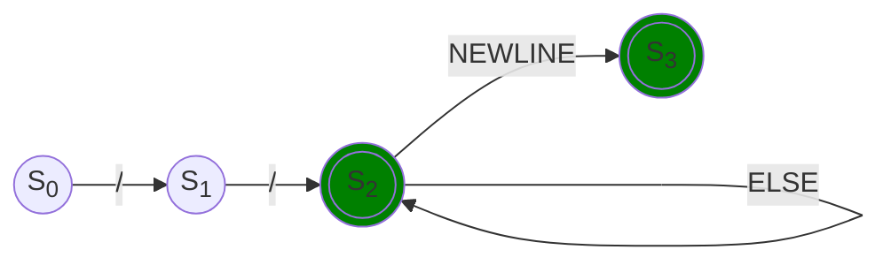
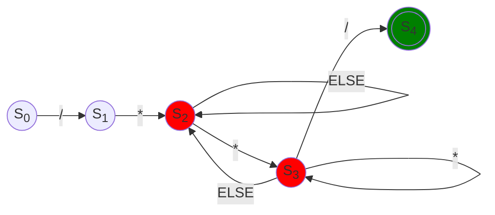

# Comments

## Single line comment

### Regex

```regexp
\/\/.*(\r\n|\r|\n|)
```

### Diagram



### Examples

```quartz
//
// Single line comment
... // Single line comment
```

## Multi line comment

### Regex

```regexp
\/\*[\s\S]*\*\/
```

### Diagram



### Examples

```quartz
/**/

/* Multi line comment */

/*
 * Multi line comment
 */
```
