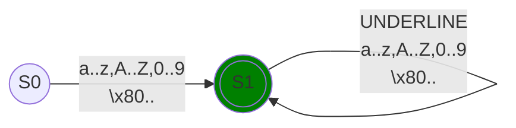
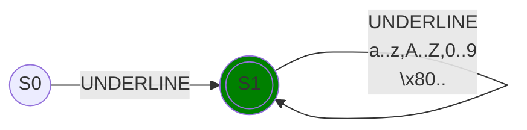

# Identifier

## Normal identifier

### Regex

```regexp
([a-zA-Z0-9]|[^\x00-\x7F])([a-zA-Z0-9_]|[^\x00-\x7F])*
```

### Diagram



### Examples

```quartz
Variable
some_var
日本語
```

## Muted identifier

### Regex

```regexp
_([a-zA-Z0-9_]|[^\x00-\x7F])*
```

### Diagram



### Examples

```quartz
_
_some_var
_日本語
___
```
