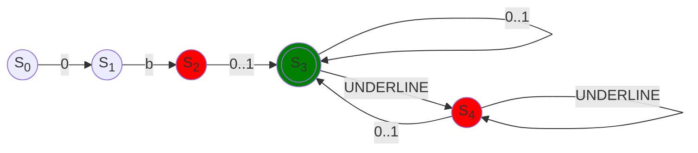
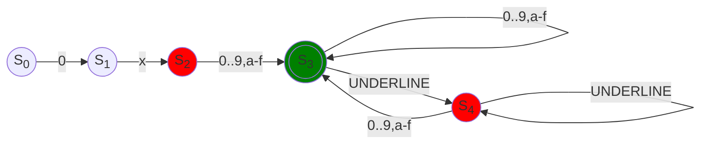
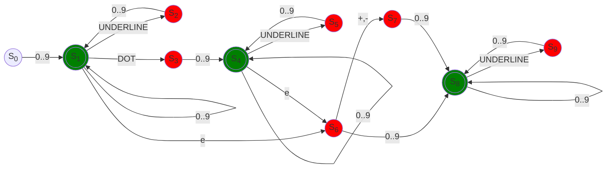

# Number literals

## Boolean notation

### Regex

```regexp
0b[0-1](([0-1]|_)*[0-1])?
```

### Diagram



### Examples

```quartz
0b0
0b01
0b0001_0000
0b1010_0101__1000_1111
```

## Octal notation

### Regex

```regexp
0o[0-7](([0-7]|_)*[0-7])?
```

### Diagram


### Examples

```quartz
0o0
0o07
0o777_777
0o777_000__777_000
```

## Decimal notation

### Regex

```regexp
0b[0-9](([0-9]|_)*[0-9])?
```

### Diagram


### Examples

```quartz
0d0
0d99
0d1_234_567_890
0d99999__99999
```

## Hexadecimal notation

### Regex

```regexp
0b[0-9a-f](([0-9a-f]|_)*[0-9a-f])?
```

### Diagram



### Examples

```quartz
0x0
0xff
0x70_ff
0xff_ff__ff_ff
```

## Scientific notation

### Regex

```regexp
[0-9]+(\.[0-9]+)?(e(\+|-)?[0-9]+)?
```

### Diagram



### Examples

```quartz
0
0.1
2.08e12
23e2
14e-6
```
