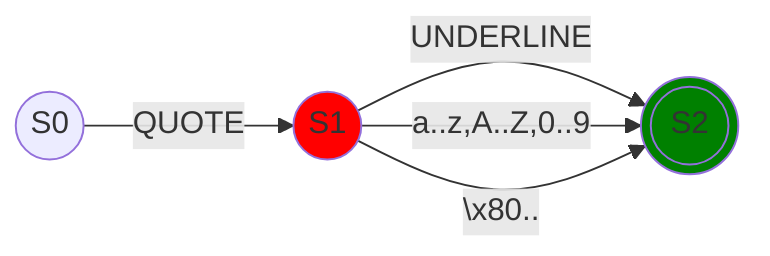

# Other literals

## Boolean literals

### Regex

```regexp
(true|false)
```

### Examples

```quartz
true
false
```

## Symbol literal

### Regex

```regexp
'([a-zA-Z0-9_]|[^\x00-\x7F])+
```

### Diagram



### Examples

```quartz
'Symbol
'日本語
'€
```
