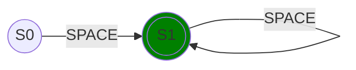
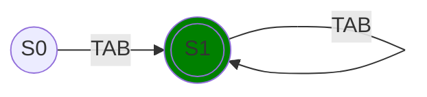
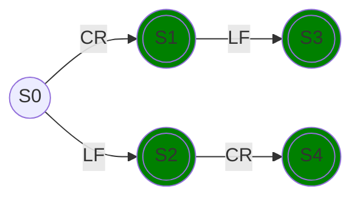

# Comments

## Space

### Regex

```regexp
(\x20)+
```

### Diagram



## Tab

### Regex

```regexp
(\x09)+
```

### Diagram



## Newline

### Regex

```regexp
(\r\n|\n\r|\r|\n)
```

### Diagram


