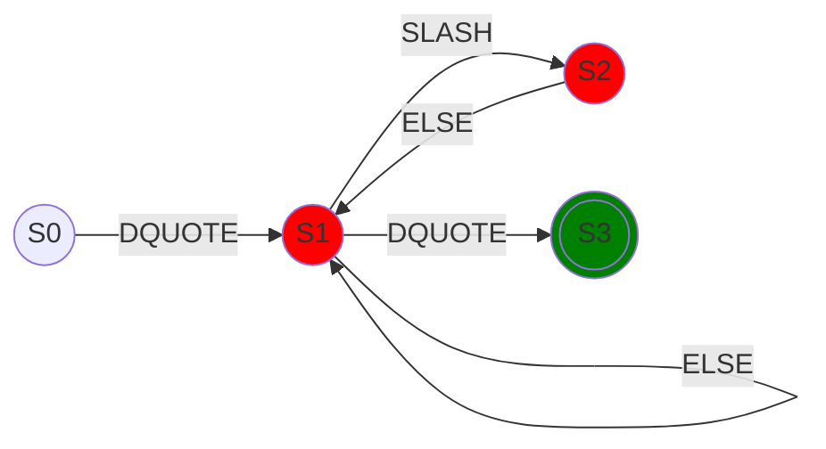

# String literal

### Regex

```regexp
\"(\\\"|[^\"])*\"
```

### Diagram


```mermaid
graph LR;
    A((S0))
    B((S1))
    C((S2))
    D(((S3)))
    style B fill: red
    style C fill: red
    style D fill: green

    A -- DQUOTE --> B
    B & C -- ELSE --> B
    B -- SLASH --> C
    B -- DQUOTE --> D
```

### Examples

```quartz
""

"This is a string"

"This is a \"string\""

"This is a
multi line
string"
```
